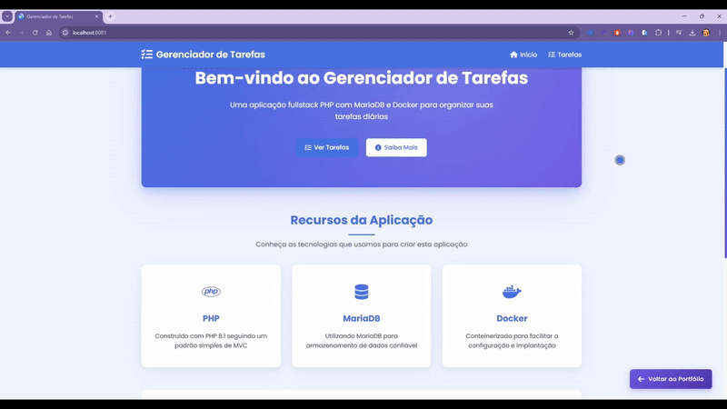

# Gerenciador de Tarefas em PHP 8.4

Um gerenciador de tarefas minimalista e elegante desenvolvido com PHP 8.4, MariaDB e Docker. Este projeto implementa um sistema simples de gerenciamento de tarefas com operações CRUD básicas.

🚀 Stack Técnica

PHP 8.4: Linguagem de programação backend com tipagem forte
MariaDB 10.6: Banco de dados relacional
Apache: Servidor web com mod_rewrite
Docker: Containerização
Tabler.io: Template administrativo com Bootstrap 5
jQuery 3: Biblioteca JavaScript para interações no frontend
Composer 2: Gerenciador de dependências do PHP
Portainer: Gerenciamento de stacks Docker
Traefik: Gerenciamento de acessos

✨ Recursos

🏗️ Arquitetura MVC simplificada
📝 Gerenciamento de Tarefas (Criar, Ler, Atualizar, Excluir)
📱 Design Responsivo
🐳 Containerização com Docker para fácil setup
💉 Injeção de Dependência
🚨 Tratamento de Erros com Exceções
🔒 Prepared Statements para segurança
🔑 Autenticação com Session segura
🗄️ Migrations para gerenciamento do banco

📋 Pré-requisitos

Docker e Docker Compose instalados
Git (opcional para clonagem)

🔧 Instalação e Configuração

Clone ou baixe este repositório:
bashCopiargit clone https://github.com/seu-usuario/gerenciador-tarefas.git
cd gerenciador-tarefas

(Opcional) Modifique o arquivo .env para definir credenciais personalizadas do banco de dados.
Inicie os containers Docker:
bashCopiardocker-compose up -d

Acesse a aplicação:

Abra seu navegador e navegue para http://localhost:8081

💻 Uso

🏠 Navegue até a página inicial para ver a visão geral da aplicação
📝 Clique em "Tarefas" para gerenciar suas tarefas
➕ Adicione novas tarefas usando o formulário
✏️ Edite ou exclua tarefas existentes

🎨 Personalização

🎨 Estilo: Modifique public/assets/css/style.css para alterar a aparência
🗄️ Banco de Dados: Edite docker/mariadb/init.sql para modificar o schema do banco
🧩 Lógica: Atualize os controllers e models no diretório src

🔍 Solução de Problemas

Se você encontrar problemas de permissão, execute:
bashCopiardocker-compose exec php chown -R www-data:www-data /var/www/html

Para visualizar logs:
bashCopiardocker-compose logs php

📄 Licença
Este projeto está disponível sob a Licença MIT.

👩‍💻 Autora
Nayara Vieira

Este projeto foi criado como um exemplo simples de uma aplicação fullstack em PHP 8.4. Tem por objetivo ser educacional e servir como ponto de partida para aplicações mais complexas.

Portfólio: https://portfolio-devnayaravieira.netlify.app
